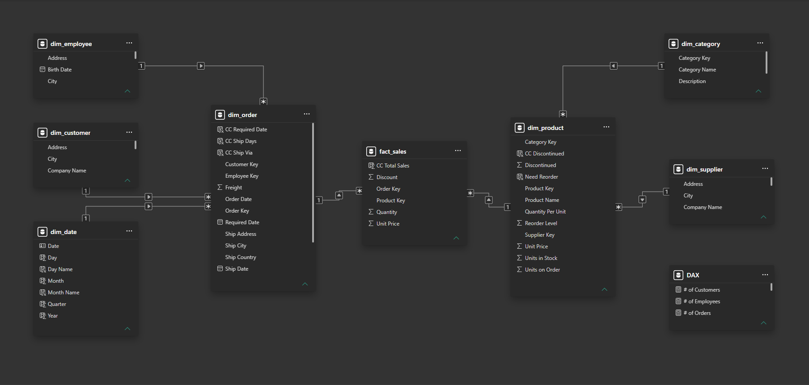

# 📊 SYSCO SALES & OPERATIONS ANALYTICS — POWER BI

> **Sales Performance | Orders & SLA | Products | Customers | Employees | Suppliers**

**Sysco Sales & Operations Analytics** is an interactive **Power BI Business Intelligence solution** built to transform transactional sales and operational data into a structured analytical experience.

The project combines **Power Query, DAX, dimensional data modeling, time intelligence, KPI development, and dashboard design** to analyze sales performance, order activity, shipping service levels, product and category performance, and the contribution of customers, employees, and suppliers.

---

## 🖼️ Dashboard Experience

The report is organized as a guided analytical journey:

**Landing → Sales & Orders → Categories & Products → Customers & Employees & Suppliers → Data Model**

### 01 — Landing

<p align="center"></p>

The entry point to the report, introducing the analytical solution and providing navigation into the main business areas.

### 02 — Sales & Orders

<p align="center"></p>

The core performance view covering sales, orders, freight, order trends, shipping activity, and service-level analysis.

### 03 — Categories & Products

<p align="center"></p>

A product-performance view covering category contribution, product rankings, inventory context, and product-level performance.

### 04 — Customers & Employees & Suppliers

<p align="center"></p>

A stakeholder-performance view connecting customer contribution, employee sales performance, and supplier/product coverage.

### 05 — Data Model

<p align="center"></p>

The Power BI model uses a dimensional structure that separates transactional facts from reusable business dimensions.

---

## 🎯 Project Objective

The objective was to create a single analytical solution that can answer questions such as:

- How much sales revenue was generated?
- How many orders and order lines were processed?
- How does sales performance change over time?
- Which countries contribute most to revenue?
- Which product categories and products drive sales?
- How much freight is associated with the order portfolio?
- How well are orders meeting required shipment dates?
- Which customers contribute the most revenue?
- How is sales performance distributed across employees?
- How broad is the supplier and product portfolio?
- How can these business questions be connected through a reusable Power BI data model?

The dashboard is designed for **business exploration and performance analysis**, not simply KPI display.

---

## 📊 Data at a Glance

The repository contains **8 structured Excel analytical tables**:

| Type | Tables | Count |
|---|---|---:|
| 📐 Dimensions | Category, Customer, Date, Employee, Order, Product, Supplier | **7** |
| 📊 Fact | Sales | **1** |
| 🗂️ Total analytical tables | Dimensions + Fact | **8** |

### Dataset Scale

| Metric | Value |
|---|---:|
| 🧾 Orders | **830** |
| 🧩 Order Lines | **2,155** |
| 👥 Customers | **91** |
| 👨‍💼 Employees | **9** |
| 🏭 Suppliers | **29** |
| 📦 Products | **77** |
| 🗂️ Categories | **8** |
| 📦 Units Sold | **51,317** |

The transactional data covers orders from **1996 through 1998**, providing a multi-year basis for time-based sales analysis.

---

## 🔎 Business Analysis & Key Insights

The following metrics were calculated from the repository's transactional source data and are presented as **descriptive observations** from the dataset.

### Executive Sales Snapshot

| KPI | Result |
|---|---:|
| **Total Sales** | **1.27M** |
| **Total Freight** | **64.94K** |
| **Orders** | **830** |
| **Order Lines** | **2,155** |
| **Average Order Value** | **1,525.53** |
| **Units Sold** | **51,317** |
| **Average Lines per Order** | **2.60** |
| **Average Units per Order Line** | **23.81** |

Sales were calculated from order-line **unit price × quantity × (1 − discount)**, using the available transactional data.

### Sales by Year

| Year | Sales | Share of Total |
|---|---:|---:|
| **1997** | **617.20K** | **48.74%** |
| **1998** | **440.62K** | **34.80%** |
| **1996** | **208.37K** | **16.46%** |

**1997** represents the largest sales year in the available dataset, contributing almost half of total recorded sales.

### Category Performance

| Category | Sales | Share |
|---|---:|---:|
| **Beverages** | **267.87K** | **21.16%** |
| **Dairy Products** | **234.82K** | **18.55%** |
| **Confections** | **167.36K** | **13.22%** |
| **Meat/Poultry** | **163.02K** | **12.88%** |
| **Seafood** | **131.26K** | **10.37%** |

The top two categories — **Beverages and Dairy Products** — contribute approximately **39.71%** of total recorded sales.

### Top Products

| Product | Sales | Share |
|---|---:|---:|
| **Côte de Blaye** | **141.40K** | **11.17%** |
| **Thüringer Rostbratwurst** | **80.37K** | **6.35%** |
| **Raclette Courdavault** | **71.27K** | **5.63%** |
| **Tarte au sucre** | **47.23K** | **3.73%** |
| **Camembert Pierrot** | **46.83K** | **3.70%** |

**Côte de Blaye** is the largest individual product contributor in the dataset, accounting for approximately **11.17%** of total sales.

### Geographic Sales Distribution

The largest sales contributions by shipping country are:

| Country | Sales | Share |
|---|---:|---:|
| **USA** | **245.67K** | **19.40%** |
| **Germany** | **230.28K** | **18.19%** |
| **Austria** | **128.00K** | **10.11%** |
| **Brazil** | **106.93K** | **8.44%** |
| **France** | **81.44K** | **6.43%** |

The **USA and Germany** together account for approximately **37.59%** of the recorded sales value.

### Employee Sales Contribution

The leading employees by attributed sales are:

| Employee | Sales | Share |
|---|---:|---:|
| **Margaret Peacock** | **232.89K** | **18.39%** |
| **Janet Leverling** | **202.81K** | **16.02%** |
| **Nancy Davolio** | **192.22K** | **15.18%** |
| **Andrew Fuller** | **166.54K** | **13.15%** |
| **Laura Callahan** | **126.95K** | **10.03%** |

The top five employees account for approximately **72.77%** of the sales value attributed through the order/employee relationship.

### Customer Concentration

The largest customers by recorded sales include:

- **QUICK-Stop:** **110.28K**
- **Ernst Handel:** **104.87K**
- **Save-a-lot Markets:** **104.36K**
- **Rattlesnake Canyon Grocery:** **51.19K**
- **Hungry Owl All-Night Grocers:** **49.98K**

The three largest customers together contribute approximately **25.25%** of total sales.

---

## 🚚 Orders & SLA Analysis

The order data supports shipping-service analysis through **Order Date, Required Date, and Shipped Date**.

### Shipping Performance

- **809 orders** have a recorded shipped date.
- **21 orders** have no shipped date in the source data.
- The average elapsed time from order to shipment among shipped orders is approximately **8.49 days**.
- **37 shipped orders** were shipped after the required date.
- Approximately **95.4%** of shipped orders met the required shipment date.

This provides a practical **SLA/service-level perspective** alongside the sales analysis.

> **Important:** SLA observations are descriptive calculations from the available order dates. They do not by themselves explain why a shipment was late.

---

## 💰 Freight Analysis

Total recorded freight is approximately **64.94K**, equivalent to around **5.13% of total sales**.

This allows the dashboard to connect revenue performance with the logistics cost represented by freight.

---

## 🔄 End-to-End BI Workflow

```text
Transactional Source Data
        ↓
Data Exploration
        ↓
Power Query Transformation
        ↓
Dimensional Data Model
        ↓
DAX Measures & Time Intelligence
        ↓
Power BI Visualization
        ↓
Interactive Sales & Operations Analysis
```

### Data Preparation

The source data was structured into separate analytical entities for:

- Categories
- Customers
- Dates
- Employees
- Orders
- Products
- Suppliers
- Sales transactions

The final repository keeps the **cleaned Excel analytical tables** under the `Dataset` folder rather than retaining the raw CSV extracts.

### Power Query

Power Query supports:

- Data type standardization
- Data transformation
- Relationship-ready table preparation
- Cleaning and shaping
- Analytical table loading

### DAX

DAX is used to create dynamic analytical measures for areas such as:

- Total Sales
- Total Freight
- Order counts
- Average Order Value
- Sales trends
- Category and product rankings
- Customer analysis
- Employee performance
- Shipping/SLA calculations
- Time intelligence
- KPI comparisons

---

## 🗂️ Data Model

The project uses a dimensional Power BI model with a central sales fact table and supporting business dimensions.

### Fact Table

**`fact_sales.xlsx`**

Contains transactional sales/order-line information used for revenue and quantity analysis.

### Dimension Tables

**`dim_category.xlsx`**
- Category information

**`dim_customer.xlsx`**
- Customer and geographic attributes

**`dim_date.xlsx`**
- Date attributes for time intelligence

**`dim_employee.xlsx`**
- Employee information

**`dim_order.xlsx`**
- Order-level information, dates, shipping, freight, and customer/employee relationships

**`dim_product.xlsx`**
- Product, category, supplier, pricing, and inventory attributes

**`dim_supplier.xlsx`**
- Supplier information

### Model Flow

```text
                 dim_date
                    │
                    │
dim_customer ──► fact_sales ◄── dim_product
                    │               │
                    │               ├── dim_category
                    │               └── dim_supplier
                    │
               dim_employee
                    │
                dim_order
```

This structure separates descriptive entities from transactional measures and supports reusable filtering across the report.

---

## 📈 Dashboard Features

### Sales Performance

- Total Sales
- Total Freight
- Number of Orders
- Average Order Value
- Sales by Year
- Sales by Country
- Shipping performance

### Product Performance

- Category contribution
- Top products
- Product-level sales
- Inventory context
- Active vs inactive products
- Reorder analysis

### Customer, Employee & Supplier Analysis

- Customer contribution
- Employee sales performance
- Supplier coverage
- Product relationships
- Geographic analysis

### KPI Framework

| KPI | Purpose |
|---|---|
| **Total Sales** | Overall sales value |
| **Total Freight** | Recorded freight cost |
| **Orders** | Number of orders |
| **Average Order Value** | Average sales per order |
| **Customers** | Customer coverage |
| **Employees** | Sales employee coverage |
| **Suppliers** | Supplier coverage |
| **Products** | Product portfolio |
| **Categories** | Product category coverage |
| **On-Time Shipment %** | Required-date service performance |

---

## 🎨 Dashboard Design & UX

The report follows the same principle used throughout the portfolio: **analytics first, but presented through a clear and structured business experience**.

The dashboard focuses on:

- Clear KPI hierarchy
- Consistent visual structure
- Business-oriented navigation
- Interactive filtering
- Comparative analysis
- Readable performance trends
- Focused analytical pages
- Separation of executive overview from detailed investigation

---

## 🧠 Analytical Challenges

### Multi-entity integration

Sales performance depends on relationships between orders, order lines, products, categories, customers, employees, and suppliers. The dimensional model keeps these entities analytically connected.

### Time-based analysis

The dedicated date dimension enables year and period-based analysis across the sales history.

### Shipping SLA

Order, required, and shipped dates allow service-level performance to be analyzed alongside commercial performance.

### Product hierarchy

Product-level results can be rolled up into categories while preserving product-level detail.

### Business concentration

Customer, country, employee, category, and product contribution can be compared to identify where sales value is concentrated.

---

## 🛠️ Technology Stack

| Technology | Role |
|---|---|
| 📊 **Power BI Desktop** | Data modeling, visualization, navigation, and dashboard development |
| 🔄 **Power Query** | Data transformation and preparation |
| 🧮 **DAX** | KPI calculations, rankings, time intelligence, and analytical measures |
| 📗 **Microsoft Excel** | Cleaned analytical datasets |
| 🗂️ **Dimensional Modeling** | Analytical data architecture |
| 📈 **Time Intelligence** | Year and period-based sales analysis |

---

## 📁 Repository Structure

```text
Sysco-Dashboard/
│
├── Dataset/
│   ├── dim_category.xlsx
│   ├── dim_customer.xlsx
│   ├── dim_date.xlsx
│   ├── dim_employee.xlsx
│   ├── dim_order.xlsx
│   ├── dim_product.xlsx
│   ├── dim_supplier.xlsx
│   └── fact_sales.xlsx
│
├── Screenshots/
│   ├── Landing Page.jpg
│   ├── Sales & Orders Page.png
│   ├── Categories & Products Page.png
│   ├── Customers & Employees & Suppliers.png
│   └── Model.png
│
├── 2.pdf
├── Sysco.pbix
└── README.md
```

---

## 📚 Data Source

The repository contains cleaned and structured Excel analytical tables derived from the underlying transactional sales dataset.

The README analysis is based on the current repository data and uses the transactional order and order-line records to calculate the reported sales, freight, product, customer, employee, geographic, and shipping metrics.

---

## 🎓 Project Context

This project demonstrates an end-to-end **Data Analyst / BI Developer** workflow:

**Data Preparation → Data Modeling → Power Query → DAX → Time Intelligence → Dashboard Design → Business Analysis**

The focus is on transforming transactional data into a reusable analytical model and then communicating the resulting business insights through an interactive Power BI experience.

---

## 👤 Author

**Kerelos Nakhla Saad**

**Data Analyst | BI Developer**

- GitHub: [Kerelos-Nakhla](https://github.com/Kerelos-Nakhla)
- LinkedIn: [Kerelos Nakhla](https://www.linkedin.com/in/Kerelos-Nakhla/)

---

⭐ **Explore the repository to review the analytical dataset, Power BI model, dashboard pages, and sales & operations analysis.**
